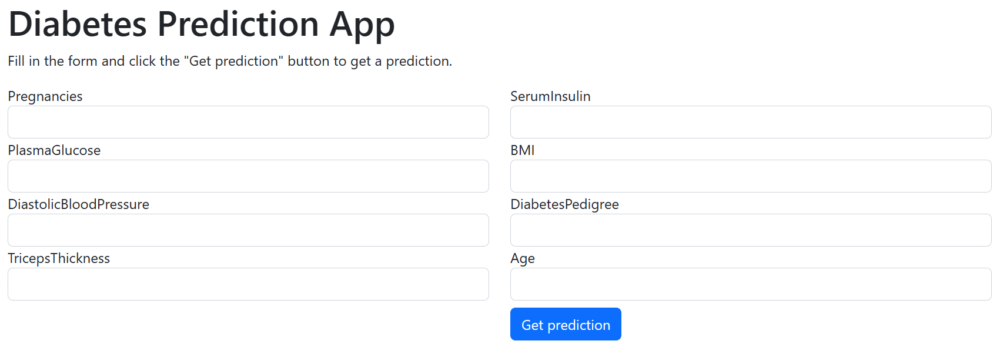

# Diabetes Prediction App

This repo contains the data and code to train and deploy a model to an online endpoint, as well as the code for a web app that uses the model to make a real-time prediction on data input by a user. Both the model and the app are hosted in Azure.

This is how the simple UI of the app looks like: 

Try the app [here](https://diabetes-prediction-example.azurewebsites.net/).

## Model training and deployment

The `model-creation` folder contains the data (`data/diabetes.csv`), the training code (`train_model.ipynb`), and the deployment code (`deploy-model.ipynb`). These scripts use Azure ML's Python SDK.

### Prerequisites

To run the notebooks the following are needed:

- An active Azure Machine Learning (AML) workspace. See [this](https://learn.microsoft.com/en-us/azure/machine-learning/quickstart-create-resources?view=azureml-api-2).
- The config.json file corresponding to the AML workspace. This file should replace `model-creation/config-example.json`.
- A Python 3.9 virtual env with the packages in `requirements-local.txt` installed.
- The data for training. The file available here can also be found in [this repo](https://github.com/MicrosoftLearning/mslearn-azure-ml/tree/main/Labs/07/data).

## App deployment

The `app` folder contains a Flask application that receives input data, consumes the trained model, and returns a prediction ("Diabetes" or "No Diabetes"). For the app to work, `.env.example` needs to be edited with the correct values for the model endpoint and the key vault name, and then renamed to `.env`.

To deploy, first "zip" the files/folder `.env`, `app.py`, `templates`, and `requirements.txt` into the file `app.zip`. Then, use Azure CLI to deploy with the following command: `az webapp deploy --name YOUR_APP_NAME --resource-group YOUR_RG_NAME --src-path .\app.zip`.

### Prerequisites

To run and deploy the app the following are needed:

- And active Azure subscription.
- An Azure key vault to save the model's endpoint key. See [this](https://learn.microsoft.com/en-us/azure/key-vault/secrets/quick-create-python?tabs=azure-cli). 
- A web app from Azure App Service. See [this](https://learn.microsoft.com/en-us/azure/app-service/quickstart-python?tabs=flask%2Cwindows%2Cazure-cli%2Cvscode-deploy%2Cdeploy-instructions-azportal%2Cterminal-bash%2Cdeploy-instructions-zip-azcli).
- Setting up a managed identity for the app service, so that it can access the key vault. See [this](https://learn.microsoft.com/en-us/azure/app-service/overview-managed-identity?tabs=portal%2Chttp).
- Assigning key vault reader access to the managed identity in the key vault access control. See [this](https://learn.microsoft.com/en-us/azure/key-vault/general/rbac-guide?tabs=azure-cli).
- The Azure CLI. See [this](https://learn.microsoft.com/en-us/cli/azure/).
- A Python 3.9 virtual env with the packages in `requirements-local.txt` installed.